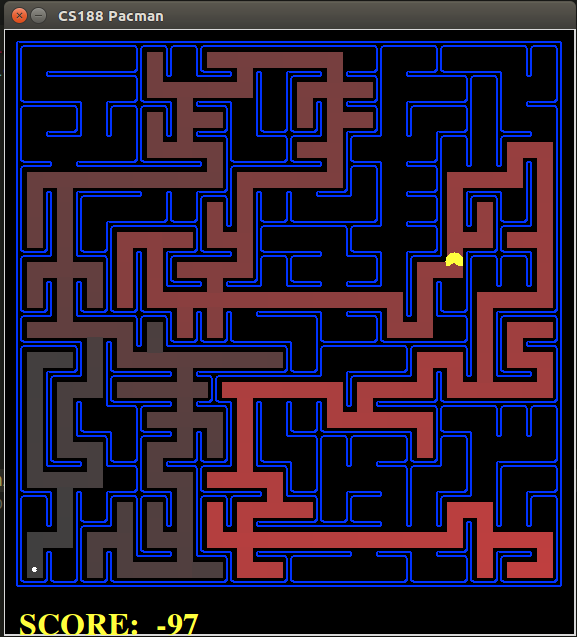
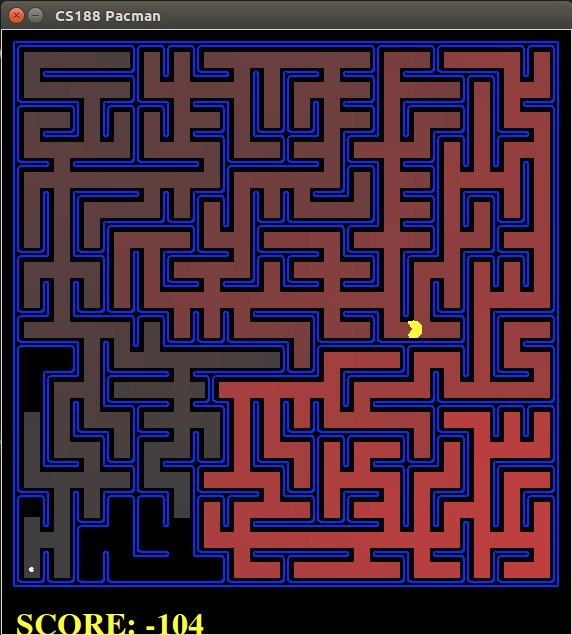
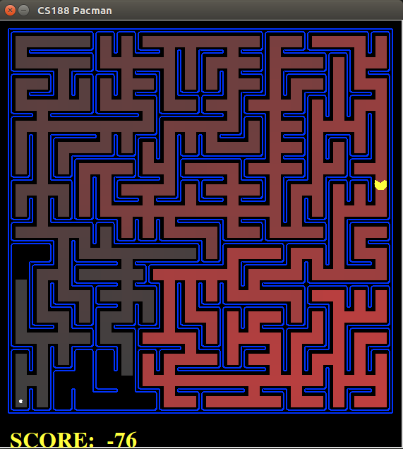
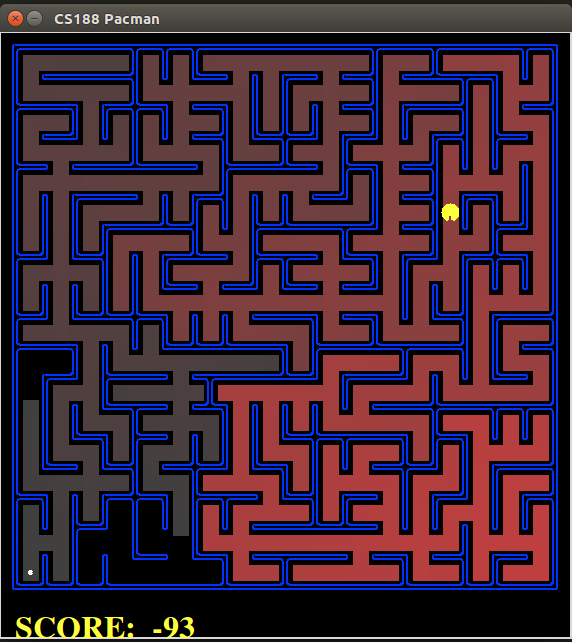

# pacman
UC Berkeley CS188 Intro to AI 


Introduction
These projects are from [UC Berkeley CS 188](http://ai.berkeley.edu/project_overview.html)


There are 2 different projects in this repository.1st project is about search and 2nd project is about reinforcement learning.


In 1st project, the Pacman agent will find paths through his maze world which is based on search algorithms such as DFS , BFS, UCS, ASTAR.
To understand the mechanism, the tiny maze is used and simple run the [pacman.py](https://github.com/erdisayar/pacman/blob/master/search/pacman.py).It will open automatically the tinymaze map and agent will find its path base on dfs algorithm.The analysis of this search in tinymaze is written in this [figure](https://github.com/erdisayar/pacman/blob/master/search/documents/IMG_20200113_161547.jpg)


To run the pacman in console, please remove the code below from the [pacman.py](https://github.com/erdisayar/pacman/blob/master/search/pacman.py)
<<<<<<< HEAD
=======

```sh
input_parameters = ['-l', 'bigMaze', '-z', '.5', '-p', 'SearchAgent', '-a', 'fn=dfs']
```
>>>>>>> 4f9aa9e83412b580bda2fec62b4bad54c7eca696

```sh
input_parameters = ['-l', 'bigMaze', '-z', '.5', '-p', 'SearchAgent', '-a', 'fn=dfs']
```

[](https://www.youtube.com/watch?v=VID)

## Depth First Search(DFS)
<<<<<<< HEAD


```sh
 python pacman.py -l bigMaze -z .5 -p SearchAgent -a fn=dfs
```
## Breadth First Search(BFS)


```sh
python pacman.py -l bigMaze -p SearchAgent -a fn=bfs -z .5
```
=======

```
$ python pacman.py -l bigMaze -z .5 -p SearchAgent -a fn=dfs

## Breadth First Search(BFS)

```
$ python pacman.py -l bigMaze -p SearchAgent -a fn=bfs -z .5

## Uniform Cost Search (UCS)

```
$ python pacman.py -l bigMaze -p SearchAgent -a fn=ucs

## A* Search


```
$ python pacman.py -l bigMaze -z .5 -p SearchAgent -a fn=astar,heuristic=manhattanHeuristic
>>>>>>> 4f9aa9e83412b580bda2fec62b4bad54c7eca696

## Uniform Cost Search (UCS)


```sh
python pacman.py -l bigMaze -p SearchAgent -a fn=ucs
```

## A* Search


```sh
python pacman.py -l bigMaze -z .5 -p SearchAgent -a fn=astar,heuristic=manhattanHeuristic
```

- DFS, BFS, UCS, ASTAR, ASTAR heuristic 
```
$ python pacman.py -l bigMaze -z .5 -p SearchAgent -a fn=dfs
$ python pacman.py -l bigMaze -p SearchAgent -a fn=bfs -z .5
<<<<<<< HEAD
```


## REINFORCEMENT LEARNING


## Q-LEARNING
[](http://www.youtube.com/watch?v=vj7c6t9Eb5w "")

## CRAWLER

[](https://youtu.be/X9o_uLF4Goc)

## PACMAN
=======


>>>>>>> 4f9aa9e83412b580bda2fec62b4bad54c7eca696

[](http://www.youtube.com/watch?v=-CDq9vIAwds "")
